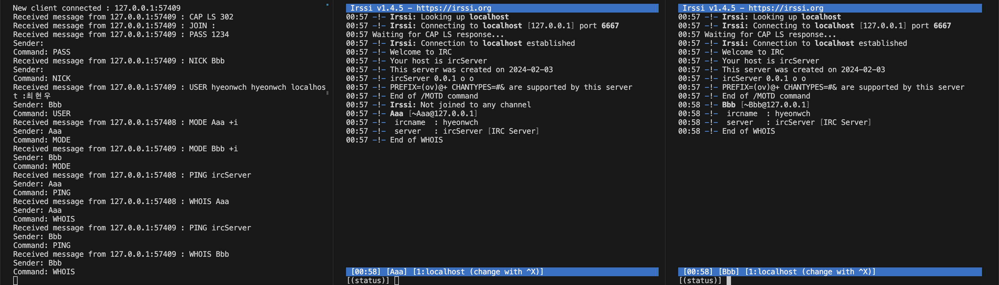
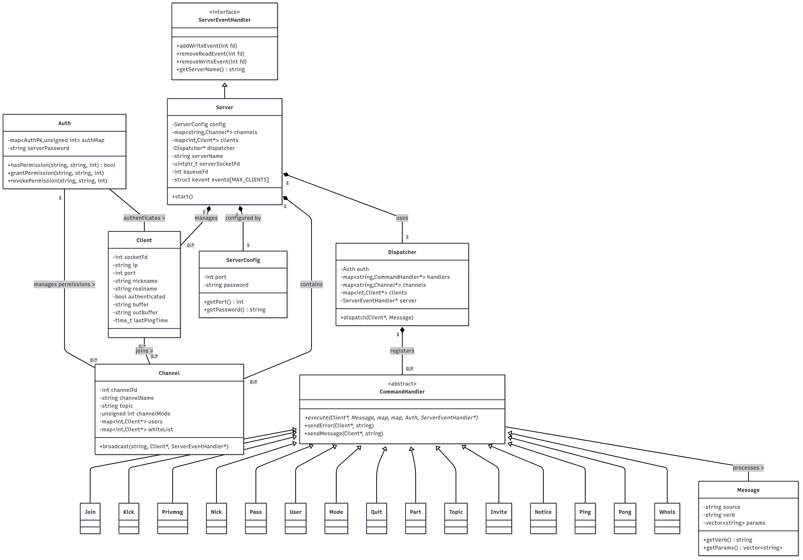

# ft_irc

1. **프로젝트 소개**
   
    - **실시간 텍스트 기반 채팅 프로토콜**
    - C++98 기반으로 **직접 IRC 서버를 구현**
    - 여러 클라이언트가 동시에 접속해 채널에 참여하고 메시지를 주고받을 수 있는 환경
3. **프로젝트 개요**
    - **목표:** RFC 표준 기반 IRC 서버를 직접 구현하여, 네트워크 프로그래밍 및 프로토콜 설계 경험 축적
    - **주요 특징:**
        - TCP/IP 기반 클라이언트 연결 관리
        - Non-blocking I/O 및 `poll()` 기반 이벤트 루프
        - 클라이언트 인증, 닉네임/유저네임 설정, 채널 생성·참여 기능
        - 채널 내 메시지 브로드캐스팅 및 운영자 권한 제어(KICK, INVITE, TOPIC, MODE)
    - **실행 방법:**
        
        ```bash
        ./ircserv <port> <password>
        ```
        
        실행 후, 표준 IRC 클라이언트(예: irssi, netcat 등)로 접속 가능
        
4. **진행한 일**
    - 프로젝트 클래스 설계
        
        
        
    - 서버 소켓 초기화 및 연결 요청 처리
    - `poll()` 기반 멀티플렉싱을 통한 다중 클라이언트 동시 처리
    - IRC 프로토콜 메시지 파싱 및 명령어 처리 로직 구현
    - 사용자 인증 및 권한(운영자/일반 사용자) 구분
    - 채널 생성, 입장, 메시지 송수신, 운영자 명령어 처리
5. **과정**
    - RFC1459 문서를 기반으로 IRC 프로토콜 스펙 분석
    - 비동기 소켓 프로그래밍을 적용하여 단일 스레드 기반 서버 모델 설계
    - 명령어 입력을 패킷 단위로 수신 → 버퍼링 → 파싱 → 실행 흐름 구축
    - 다양한 클라이언트(irssi, nc 등)로 연결 테스트 및 기능 검증
6. **결과물**
    - **완성된 IRC 서버 프로그램:** 클라이언트 인증 및 채널 기반 실시간 메시지 송수신 가능
    - **권한 제어 기능:** 운영자가 특정 명령어(KICK, INVITE, TOPIC, MODE)를 통해 채널 관리 가능
    - **표준 호환성:** 실제 IRC 클라이언트를 사용해 정상적으로 연결 및 채팅 가능
7. **성장한 점**
    - C++98 환경에서의 **네트워크 서버 프로그래밍 전반**을 직접 경험
    - `poll()` 기반 이벤트 루프 설계로 **효율적인 비동기 서버 구조** 이해
    - 프로토콜 스펙 분석 및 적용을 통한 **표준 기반 개발 역량** 강화
    - 프로젝트 전 과정을 혼자 수행하며 **설계 → 구현 → 테스트 → 디버깅** 전 주기 경험
8. **역량**
    - TCP/IP 소켓 프로그래밍 및 비동기 I/O 처리 능력
    - 네트워크 프로토콜 설계 및 파싱 로직 구현 역량
    - 서버 아키텍처(이벤트 루프 기반) 설계 경험
